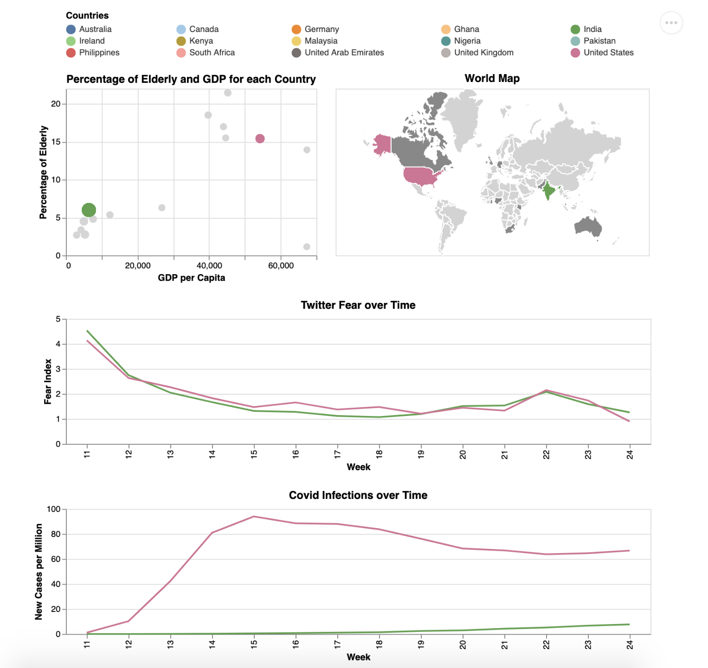

# Project name

The main goal of our visualization is to show readers that there exists a large disconnect between fear and reasons to be fearful. We aim to tell this story by using Coronavirus and Twitter statistics from 15 countries. We display this to the users by letting them explore the effect that both geographical and statistical proximity between countries has on fear and Covid statistics over time. The fact that the number of Covid cases, the number of Covid deaths, the percentage of elderly, the GDP per Capita and the geographical location of a country only has a small effect on fear over time suggests that human fear tends to be bursty and driven by mass-panic rather than routed in rational danger calculations. Also, one of our side objectives with the visualization was to show how Covid statistics in third world countries can be quite unreliable due to low testing.

## Project Goals

“The only thing we have to fear is fear itself” -Franklin D. Roosevelt.  

As all people of the world cope with the very real danger of Coronavirus we sought to answer the question “How well does fear correlate with actual danger”.  Part and parcel of answering this question is investigating whether fear is sustained and data-driven or bursty and informed by mass-panic.

When starting the project we knew we wanted to work with social media reactions, and to see how fear could be quantified as Coronavirus swept across the world.  We also wanted to see if we could find data that would be incredibly difficult to predict, and that only through real examination and analysis could meaning be deciphered. One of our side goals was to provide a global perspective because sometimes in the United States we can begin to believe that our view is the view of the entire world.

## Design

For selecting, we wanted 2 graphs: one statistical and one geographical. The reason behind this is that on one hand Covid fears are informed by stats such as the percentage of vulnerable elderly and the accessibility of high-quality healthcare. However, on the other hand the fears are informed by geographical aspects and shared cultural values. Thus it was important for us to allow the user to explore trends through both the statistical and the geographical lens. 

To convey Fear we created a measure called the “Fear Index”. This quantity was obtained by calculating the percentage of covid-related tweets for a given week and country that contained fear-based keywords. We used a list of 56 keywords that were roughly synonymous with “fear” including but not limited to “frightened”, “afraid”, “fearful” , “nervous”, “panicky" and “agitated”. To convey fear and Covid statistics we used a line graph instead of a bar chart as it allows us to compare one country’s statistics directly against another country’s. We decided to put the “New Deaths per million” on its own graph because when sharing a graph with “New Cases per million” it looked so small in comparison that its changes could not be visually interpreted.

In our readings we read about the importance of a guide that takes the user through the chronological stages of the visualization. Thus we place instructions on the top and interesting details at the bottom. One of our goals was to allow all of the data to be accessible simultaneously so that changes with one parameter would instantly be seen across all fields. As a result, we pre-cleaned and pre-filtered our data to increase the simplicity and speed of selections and conditions.

## Development

Our first step to development was a group brainstorming session.  During this we bounced ideas off each other and agreed on goals for our project. This ended with us agreeing to sell each other on an idea the next day, after playing with different data sources. The next day we spent roughly two hours discussing the data we had found and its potential for interactivity.  At this point we knew we wanted to work with Coronavirus related tweets, and we decided on our main metric being the “Fear Index”.  We worked on a list of 56 fear-related words and were able to see how many tweets were available that expressed fear from those words.  We then decided an interactive element of the data could be showing how often certain words showed up in fear based tweets. We were quite surprised to find out that the most prevalent non-fear word in fear based tweets was “Trump”, with this we knew we had an idea worth running with.
Unfortunately, this idea quickly suffered from a lack of interactivity. The problems was that the user experience did not feel free, rather, our interaction forced the user down a set cognitive path.
Once we began graphing the data we saw that the correlation between the number of fear based tweets and the actual cases was actually quite odd.  We noticed that most of the world actually followed the trends set by the United States and Western Europe.  This indicates that much of the world is actually very in touch, and influenced by the opinions expressed by “The Western World”.  Another surprising trend we found was that after an initial spike in fear based tweets people seemed to “grow bored” with the fear aspect of Coronavirus.  The high influx of cases seemed to lag about two weeks behind the spike in fear, and fear levels actually dropped over time despite cases actually rising.  This seemed counter-intuitive, as surely more people would be afraid as the actual chances of catching the virus, and thus the danger from it grew. This seemed to reiterate the common knowledge, that people are far more afraid of the unknown, than they are of any real danger. The actual analysis aspect of the project is difficult to precisely put into time, but I would estimate about 10 hours each with frequent calls and texts to discuss potential significance of findings, and ensuring we were not accidentally allowing any bias to influence our data. In addition to the Twitter Dataset we used the World Coronavirus statistics Dataset.
Finally, we debated what metrics would be most accurate to use in displaying coronavirus cases.  We worried that using confirmed cases might bias numbers away from countries with limited testing.  We also worried that using the death rate may bias towards countries with poor healthcare.  While we debated this, we realized that the whole world struggles with this issue currently. After talking with epidemiology graduates, we learned that finding internationally standardised metrics of actual covid cases is actually an extremely challenging task. As a result, we chose to use the number of new cases and deaths, and allow insufficient testing to be one of the discoveries that users could extract from our visualization. 
In terms of the work split, Bradley’s main focus was the exploratory data analysis and the design decisions behind our visualization. On the other hand, Christian focussed on using Streamlit and Altair to code prototypes and the final visualization. It should be mentioned that communication was very frequent and that most tasks were shared. 
We breakdown the people-hours as follows - 1) Ideation and EDA - 20 hours 2) Developing initial prototypes - 10 hours 3) Developing final visualisation - 15 hours
